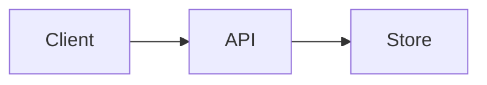

import {useState} from 'react';
import Tabs from '@theme/Tabs';
import TabItem from '@theme/TabItem';

# Docusaurus and VuePress

Compare [the VuePress-flavored Markdown page](./vuepress-syntax.md) with this MDX page. Both files are rendered by Docusaurus here; VuePress-only features are shown as source so unsupported syntax stays visible instead of being misread as MDX. Use the version selector to compare this **Latest** page with the original **1.0.0** snapshot.

## Front matter, routes, and links {/* #front-matter-and-links */}

Both tools use YAML front matter, Markdown headings, links, lists, tables, and fenced code blocks. Docusaurus also uses front matter for document IDs, sidebar placement, tags, and other docs metadata. The configured permalink is derived from the file path unless you set `slug`.

| Developer-doc feature | Docusaurus | VuePress |
| --- | --- | --- |
| Front matter | `id`, `slug`, `sidebar_position`, tags | `permalink`, `head`, `lang`, theme/plugin options |
| Page format | `.md` and `.mdx` | `.md` with Vue component support |
| Internal links | Doc IDs, relative paths, or routes | Relative paths, clean URLs, and theme routes |
| Anchors | `{/* #anchor */}` in MDX | `{#anchor}` in Markdown |
| Sidebar | `sidebars.ts` plus front matter | Theme config, page metadata, or plugins |
| Components | Imported React/MDX components | Registered Vue components |
| Callouts | `:::note`, `:::tip`, `:::warning`, `:::danger` | Theme containers such as `::: tip` and `::: details` |
| Code tabs | `<Tabs>` and `<TabItem>` | Theme/plugin-specific containers and fences |
| Versioning | Built-in versioned docs and dropdown | Typically configured through theme/plugins |
| API explorer | React iframe/component plus static API spec | Vue component or plugin, if configured |

Use [the matching VuePress examples](./vuepress-syntax.md#shared-markdown) to compare common syntax, or jump to [the Swagger demo](#interactive-openapi-demo).

### Sidebar metadata and version routes

This page's front matter sets its sidebar order. A document can also set a stable ID, URL, and tags:

```yaml title="Docusaurus front matter"
---
id: api-overview
title: API overview
slug: /api/overview
sidebar_position: 2
tags:
  - api
  - reference
---
```

The `Latest` docs are the current `docs/` tree. The `1.0.0` snapshot lives under `versioned_docs/version-1.0.0/`; Docusaurus generates separate routes and sidebars for it. A versioned docs snapshot does not version the blog or shared static assets.

## Docusaurus MDX {/* #docusaurus-mdx */}

MDX lets this page import React components and render them in the document. Click the counter to run the component in place:

export const ClickCounter = () => {
  const [count, setCount] = useState(0);
  return <button type="button" onClick={() => setCount((value) => value + 1)}>Clicked {count} times</button>;
};

<ClickCounter />

### Tabs and highlighted code

The tab components below are provided by the Docusaurus theme. They are not plain Markdown and will not render in VuePress without an equivalent component or plugin.

Each sample calls `GET https://jsonplaceholder.typicode.com/todos/1`, matching the server and path in the OpenAPI spec below. Change `1` to another todo ID from 1 to 200. These are copyable examples; the tabs only display code.

<Tabs groupId="api-client-language">
  <TabItem value="curl" label="cURL">

```bash
curl --fail --silent --show-error \
  https://jsonplaceholder.typicode.com/todos/1
```

  </TabItem>
  <TabItem value="javascript" label="JavaScript">

```js title="get-todo.js"
const response = await fetch('https://jsonplaceholder.typicode.com/todos/1');
if (!response.ok) throw new Error(`HTTP ${response.status}`);
console.log(await response.json());
```

  </TabItem>
  <TabItem value="python" label="Python">

```python title="get_todo.py"
import requests

response = requests.get(
    'https://jsonplaceholder.typicode.com/todos/1', timeout=10
)
response.raise_for_status()
print(response.json())
```

  </TabItem>
  <TabItem value="go" label="Go">

```go title="get_todo.go"
package main

import (
  "fmt"
  "io"
  "net/http"
)

func main() {
  response, err := http.Get("https://jsonplaceholder.typicode.com/todos/1")
  if err != nil {
    panic(err)
  }
  defer response.Body.Close()

  if response.StatusCode != http.StatusOK {
    panic(response.Status)
  }
  body, err := io.ReadAll(response.Body)
  if err != nil {
    panic(err)
  }
  fmt.Println(string(body))
}
```

  </TabItem>
</Tabs>

### Lists, tables, and inline code

Use standard Markdown for the building blocks of a reference page:

- `GET /todos/{id}` identifies an endpoint.
- **Required** values can be emphasized in prose.
- Link to [the OpenAPI example](#interactive-openapi-demo) instead of duplicating it.

| Field | Type | Example |
| --- | --- | --- |
| `id` | integer | `7` |
| `completed` | boolean | `false` |

### React components and live values

An MDX component can accept props and render data-driven examples. This is React, not Vue template syntax:

```jsx title="React component in MDX"
export const Status = ({ok}) => (
  <span>{ok ? 'Available' : 'Unavailable'}</span>
);

<Status ok={true} />
```

The counter above is a live React component. State, event handlers, and JSX expressions are evaluated by MDX when the page renders.

## Docusaurus callouts and details

:::tip[Conversion check]
This admonition syntax is supported by Docusaurus and VuePress. Similar-looking syntax does not guarantee identical theme styling or behavior.
:::

<details>
  <summary>MDX can include HTML and JSX</summary>

This collapsible section uses HTML details markup, which Docusaurus renders in MDX.
</details>

### Images and downloadable assets

Static files placed in `static/` are available from the site root. This same URL style works in VuePress when the image is placed in its public directory:


```md

```

For an image next to a Docusaurus doc, use a relative path and let the docs plugin bundle it. VuePress also commonly uses relative Markdown image paths or files in `public/`.

### Links and heading anchors

Docusaurus MDX uses an MDX comment to set an explicit heading ID; VuePress commonly uses curly-brace heading attributes:

```md
<!-- Docusaurus MDX -->
## Authentication {/* #authentication */}

<!-- VuePress -->
## Authentication {#authentication}
```

Both systems generate heading anchors by default, but custom anchor syntax should be checked during conversion.

### Diagrams and generated content

Diagram languages and generated API references are plugin-dependent in both systems. A fenced Mermaid block, for example, is only a diagram when a compatible Mermaid integration is installed; without it, it is just code. Keep the source in a fence when portability matters:

````md

````

## Interactive OpenAPI demo {/* #interactive-openapi-demo */}

The explorer below uses Swagger UI and the [demo OpenAPI 3.0 spec](/openapi/demo.yaml). Select **Try it out** on `GET /todos/{id}`, enter an ID, then execute the request. It calls JSONPlaceholder, so the browser needs network access. The specification itself is an ordinary downloadable YAML asset; the explorer is a separate static page embedded in this MDX document.

```yaml title="OpenAPI path excerpt"
paths:
  /todos/{id}:
    get:
      summary: Get a todo by ID
      parameters:
        - name: id
          in: path
          required: true
          schema:
            type: integer
      responses:
        '200':
          description: Todo record
```

<iframe
  title="Interactive Swagger UI for the demo OpenAPI specification"
  src="/swagger-demo.html"
  width="100%"
  height="850"
  loading="lazy"
  style={{border: '1px solid var(--ifm-color-emphasis-300)', borderRadius: '4px'}}
/>

## VuePress-only syntax in Docusaurus {/* #vuepress-only-syntax */}

The paired [VuePress Markdown page](./vuepress-syntax.md) includes VuePress component and container examples as fenced source. Docusaurus displays those examples rather than executing them; converting a VuePress site may require replacing its theme components and plugins. For the reverse conversion, replace React imports, JSX expressions, and Docusaurus theme tags with registered Vue components or plain Markdown.